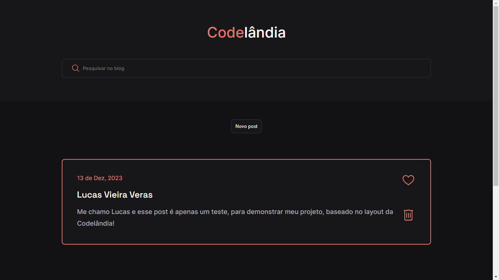

# BLOG

Este projeto foi um desafio proposto pelo <a href="https://www.linkedin.com/in/iuricode/">Iuri Silva</a>. Um blog simples, com algumas postagens.

### Tecnologia utilizadas:
- *HTML*
- *CSS*
- *JavaScript*

### Status do projeto:
**Finalizado ✅**

### Funcionalidades
- [x] Criação de novos posts.
- [x] Exclusão de posts
- [x] Favoritar/Gostar de posts

### Links:
**[Layout no Figma](https://www.figma.com/file/Yb9IBH56g7T1hdIyZ3BMNO/Desafios---Codel%C3%A2ndia?type=design&node-id=0-1&mode=design&t=OluItDI5XsBfeNR2-0)**

**[Demo](https://lucavieira.github.io/blog/)**

### Autor

<a href="https://github.com/lucavieira">
 
  
 <b>Lucas Vieira</b></a> <a href="https://github.com/lucavieira" title="Github">🚀</a>

Feito com ❤️ por Lucas Vieira 👋🏽 Entre em contato!

 

